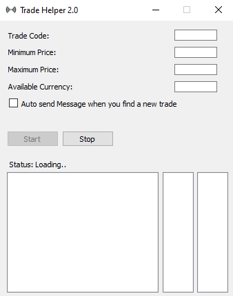

# PathOfExile Trade Helper

<!-- ABOUT THE PROJECT -->
## About The Project



Path of Exile Trade Helper is an app to help you speed through bulk item trading offers in an easy and comfortable way using a dedicated GUI and message automation.

### Built With

* [Python](https://www.python.org/)
* [Selenium](https://www.selenium.dev/)
* [PyQt](https://www.riverbankcomputing.com/software/pyqt/)


<!-- GETTING STARTED -->
## Getting Started

There are a few librarier that need to be installed in order for the app to work.

### Prerequisites
  ```sh
  npm install npm@latest -g
  ```

### Installation

1. Clone the repo
   ```sh
   git clone https://github.com/andreiec/poe-trade-helper-2.git
   ```
2. Install NPM packages
   ```sh
   npm install
   ```
3. Install geckodriver [(Firefox)](https://github.com/mozilla/geckodriver/releases)

<!-- USAGE EXAMPLES -->
## Usage


PoE Trade Helper is built upon Firefox Geckodriver and Selenium. A very simple to understand workflow of the app is the following
1. Get user input
2. Load the corresponding trade page
3. Loop through all suitable trades
4. Get all info about each trade (username, price ratio, etc.)
5. Display trades and refresh old ones
6. Loop through steps 3-5

### User Input

Its simplicity is the key feature as there are no more than 5 input fields

* `Trade Code` is the number associated with the trade. Simply choose a trade and copy the code from the URL
* `Minimum Price` is the minimum price that a trade should hold (ratio is calculated)
* `Maximum Price` is the maximum price that a trade should hold (ratio is calculated)
* `Available Currency` holds the maximum currency that the user is willing to trade, it is used to calculate price ratio
* `Auto send Message` tells the app to open the game and automatically send a message to the first trade that appears (instead of manual clicking)

<!-- LICENSE -->
## License

Distributed under the MIT License. See `LICENSE` for more information.
